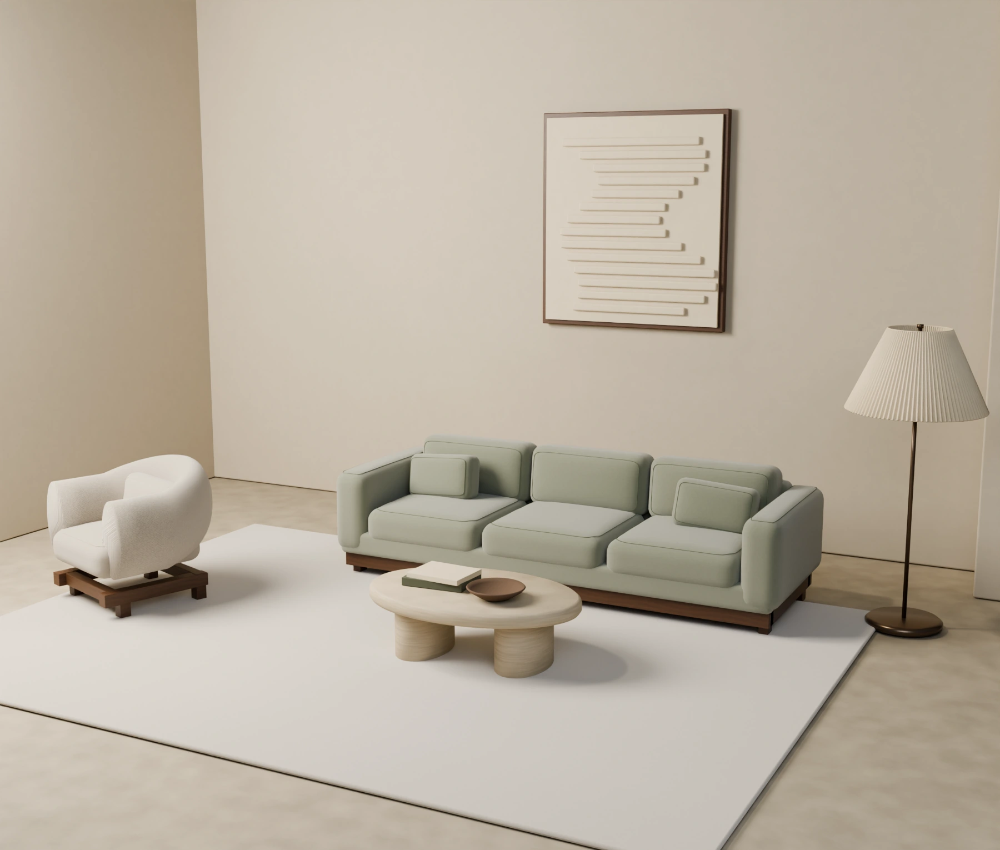

# FORME — Objects for living

Native Shopify Online Store 2.0 furniture theme with an optional Three.js Arc configurator. The public portfolio preview simulates commerce locally; it is not Shopify checkout and accepts no payment.

## Atelier — storefront and furniture art



The storefront now pairs a Material-inspired olive-and-stone design system with original Blender furniture: three reworked Arc configurations, a sculpted Vale chair, a bullnose travertine Monolith table and a physically pleated Lumen lamp. The homepage colour study opens exact native variants; the 3D studio offers Daylight and Warm light without changing commerce state.

Read the [Atelier production and verification guide](docs/ATELIER.md) for scope, model sources, reproduction, limitations and editable design boards. The Figma connector created a new file but hit the Starter-plan MCP quota before canvas editing; the repository includes editable SVG handoff boards and token data instead of claiming completed Figma work.

## Arc Experience V2

Arc now has a coordinated responsive product page, readable shopping typography, three separately authored size models, original physical-scale material maps, 36 matching configuration posters, a keyboard-operable enlarged gallery, independent measurement diagrams and responsive 3D inspection controls. Selection, dimensions, shared links and bag imagery follow one validated product contract. Rapid cart changes preserve user intent; keyed updates preserve focus and delivery-note drafts.

Read [the implementation and verification guide](docs/ARC-EXPERIENCE-V2.md) for source ownership, original asset reproduction, commands, budgets and remaining scope. This is the earlier Arc data-contract milestone; Atelier extends its art and applies a coordinated storefront design without replacing that contract.

Quality evidence is uploaded by [the acceptance workflow](.github/workflows/storefront-quality.yml) and [Arc asset production](.github/workflows/render-assets.yml). Use a specific successful run and its artifacts rather than treating historical test counts as current evidence. Figma's existing file is an earlier baseline, not the V2 source of truth. Native Shopify checkout and merchant-editor acceptance still require an authorized development store.

## Run locally

Node.js 22 and Python 3 are required for the development and packaging scripts.

```sh
npm ci
npm run build
npm test
npm run typecheck
npm run check
npm run verify:arc
npm run preview
```

Open `http://localhost:4173`. The development server renders the actual Liquid sections against isolated fictional product fixtures. It is **not a Shopify server**. A visible banner and checkout warning distinguish its browser-local order simulation from Shopify test mode.

```sh
npx playwright install chromium firefox webkit
npm run test:e2e
npm run package
node scripts/export-catalog.mjs
node scripts/static-preview.mjs
npm run test:static
```

The installable archive is `artifacts/FORME-Shopify-Theme.zip`. It contains only theme directories, not fixture data or the preview adapter. Follow [the merchant setup guide](docs/MERCHANT-SETUP.md) to install it on an unpublished development-store theme.

## What is implemented

Collection filtering and sorting; product galleries and native variant forms; a lazily loaded Three.js Arc configurator; actual variant IDs and server prices in the native cart; unavailable configurations; shareable `?variant=` links; Ajax cart editing and persistence through Shopify; native hosted checkout submission; a fabric-sample product; persistent comparison of up to three products; four merchant-positionable shoppable-room markers; product/editorial pages; native newsletter/contact forms; responsive and keyboard-accessible controls.

Arc has **36 fixture variants**: three sizes × three fabrics × four colours. Changing upholstery or size selects a different variant and price. One configuration and the Halo pendant demonstrate out-of-stock handling. The original model bounds are approximately Compact 224 × 103 × 83 cm, Generous 284 × 103 × 83 cm and Chaise 304 × 182 × 83 cm. These are rounded model measurements, not manufacturing drawings.

## Native theme versus portfolio preview

| Concern | Installed Shopify theme | Standalone portfolio preview |
|---|---|---|
| Product/variant data | Shopify Liquid product objects | Fictional fixture catalogue |
| Price/inventory authority | Shopify Ajax Cart API | Browser-local simulator |
| Checkout | Shopify hosted checkout | Explicitly labelled simulation; no payment fields |
| Order confirmation | Shopify's own checkout/order pages | Browser-local demonstration only |
| Contact/newsletter | Shopify native forms | Validates input; does not submit or save it |
| Merchant editing | Shopify Theme Editor and product admin | Not simulated as a real merchant admin |

**A real Shopify test order and merchant-editor recording have not been verified without an attached Shopify development store.** The preview must not be presented as that evidence. No payments are accepted by the preview.

## Source map

`layout/`, `sections/`, `snippets/`, `templates/`, `config/`, `locales/`: native theme. `src/theme.js`: composition and progressive enhancement. `src/product.js`, `src/cart.js`, `src/cart-state.js`, `src/cart-dom.js`: independent product and cart responsibilities. `src/configurator.js`: on-demand PBR viewer with context-loss handling and disposal. `src/core.js`: testable variant, quantity, URL and comparison logic. `tools/arc-spec.json`, `tools/arc-materials.py`, `tools/arc-assets.py`, `tools/arc-pack.py`: canonical Arc V2 specification, materials, geometry and renders. `tools/build_assets.py`: legacy non-Arc collection scenes. `tools/Arc-master.blend`: original editable sofa. `preview/`, `fixtures/`, `scripts/liquid-renderer.mjs`: isolated demonstration adapter. `tests/`: domain and browser regression tests.

Read [asset provenance](docs/ASSET-PROVENANCE.md), [architecture](docs/ARCHITECTURE.md) and [the acceptance checklist](docs/ACCEPTANCE.md) before presenting or publishing the store.

## Release integrity

Routine CI uses npm ci, audits dependencies, verifies generated-file drift and all authored resources, and tests both the Liquid preview and its packaged static counterpart. The manual rendering workflow produces review artifacts, never automatic source overwrites. The legacy GitHack publisher is manual; a GitHub commit does not update the separate ChatGPT Site.
